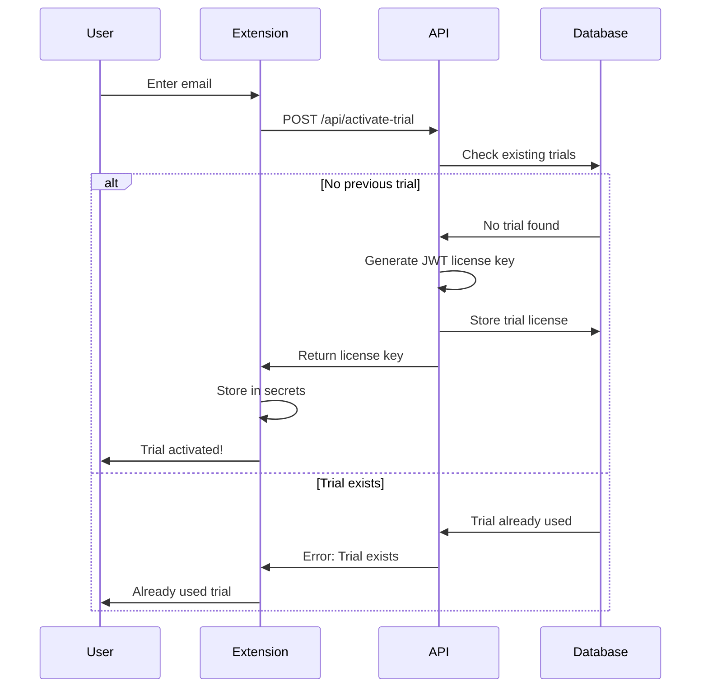
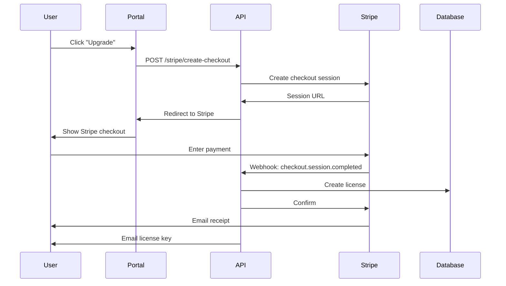
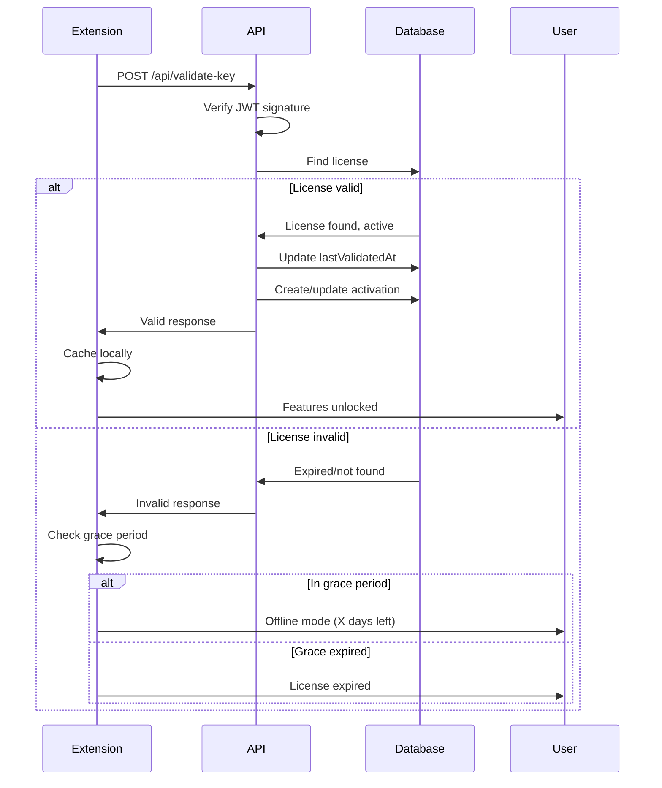

# AI Supervisor - License System Overview

Complete overview of the licensing and payment system architecture.

## System Architecture

```
┌─────────────────┐
│  VS Code Ext    │
│  (Client)       │
└────────┬────────┘
         │
         │ HTTPS
         ▼
┌─────────────────┐      ┌──────────────┐
│ Licensing API   │◄─────┤   Stripe     │
│  (Vercel)       │      │  (Payments)  │
└────────┬────────┘      └──────────────┘
         │
         │ PostgreSQL
         ▼
┌─────────────────┐
│   Database      │
│  (Licenses)     │
└─────────────────┘
         ▲
         │
┌────────┴────────┐
│  User Portal    │
│   (Next.js)     │
└─────────────────┘
```

## Components

### 1. Licensing API (`/licensing-api`)

Serverless API handling:
- License key generation (JWT-based)
- License validation
- Trial activation
- Stripe checkout integration
- Webhook processing

**Tech Stack:**
- TypeScript
- Vercel Serverless Functions
- Prisma ORM
- PostgreSQL
- Stripe SDK
- JWT for license keys

### 2. User Portal (`/user-portal`)

Web dashboard for users to:
- View active licenses
- Download license keys
- Manage subscriptions
- Access invoices
- Update billing info

**Tech Stack:**
- Next.js 14
- React
- Tailwind CSS
- Stripe Customer Portal
- Prisma Client

### 3. VS Code Extension Integration (`/vscode-extension`)

Extension features:
- License activation UI
- Runtime feature gating
- Offline grace period support
- Status bar indicator
- Upgrade prompts

**Components:**
- `LicenseManager.ts` - Core licensing logic
- `LicensePanel.ts` - Webview UI for activation
- `types.ts` - TypeScript definitions

## License Flow

### Trial Activation Flow



### Purchase Flow



### Validation Flow



## Feature Gating

### Free Tier (Default)

Available features:
- ✅ Basic memory tracking
- ✅ Simple deviation detection
- ✅ Single project support
- ✅ Local storage only
- ❌ Advanced AI analysis
- ❌ Multi-project support
- ❌ Cloud sync
- ❌ Team features
- ❌ Priority support

### Premium Tier

All free features plus:
- ✅ Advanced AI-powered deviation detection
- ✅ Multi-project workspace support
- ✅ Cloud backup and sync
- ✅ Team collaboration features
- ✅ Priority email support
- ✅ Extended history (90 days vs 7 days)

### Implementation Example

```typescript
// Check feature access
if (!licenseManager.hasFeature('advancedAnalysis')) {
  licenseManager.showUpgradePrompt('Advanced Deviation Detection');
  return;
}

// Premium feature code here
await performAdvancedAnalysis();
```

## Pricing Structure

| Plan | Monthly | Annual | Features |
|------|---------|--------|----------|
| Free | $0 | $0 | Basic features |
| Individual | $12 | $100 | All premium features, 3 devices |
| Student | $6 | $50 | 50% discount, 3 devices |
| Team | $20/seat | $180/seat | Team features, 25 seats |
| OSS | Free | Free | For active OSS contributors |

**Trial:** 14 days free, all premium features

## Security Features

### 1. JWT-Based License Keys

- Cryptographically signed with HS256
- Contains: user ID, email, type, expiration, license ID
- Cannot be forged without secret key
- Expires automatically based on subscription

### 2. Activation Limits

- Individual/Student: 3 devices max
- Team: 25 seats
- Trial: 1 device
- Deactivation supported to switch devices

### 3. Offline Grace Period

- 7 days without internet connection
- License remains valid during grace period
- Resumes validation when online
- Prevents accidental lockout

### 4. Webhook Signature Verification

- All Stripe webhooks verified with signature
- Prevents webhook forgery
- Idempotent processing (no duplicates)

### 5. Secure Storage

- License keys stored in VS Code secrets API
- Environment variables for API keys
- Database passwords encrypted
- No sensitive data in logs

## Database Schema

### Users Table

```sql
User {
  id: UUID (PK)
  email: String (unique)
  name: String?
  stripeCustomerId: String? (unique)
  createdAt: DateTime
  updatedAt: DateTime
}
```

### Licenses Table

```sql
License {
  id: String (PK)
  key: String (unique, JWT)
  userId: UUID (FK → User)
  type: String (individual, team, student, oss, trial)
  status: String (active, expired, cancelled, suspended)
  billingPeriod: String? (monthly, annual)
  issuedAt: DateTime
  expiresAt: DateTime
  lastValidatedAt: DateTime?
  stripeSubscriptionId: String? (unique)
  stripePriceId: String?
  maxActivations: Int
  currentActivations: Int
  metadata: JSON?
}
```

### Activations Table

```sql
Activation {
  id: UUID (PK)
  licenseId: String (FK → License)
  machineId: String
  activatedAt: DateTime
  lastSeenAt: DateTime
  deactivatedAt: DateTime?
  metadata: JSON?

  UNIQUE(licenseId, machineId)
}
```

### Validation Logs Table

```sql
ValidationLog {
  id: UUID (PK)
  licenseId: String (FK → License)
  timestamp: DateTime
  valid: Boolean
  reason: String?
  ipAddress: String?
  userAgent: String?
}
```

## API Endpoints Summary

### Public Endpoints

| Endpoint | Method | Description |
|----------|--------|-------------|
| `/api/validate-key` | POST | Validate license key |
| `/api/activate-trial` | POST | Start free trial |
| `/stripe/create-checkout` | POST | Create payment session |
| `/stripe/create-portal-session` | POST | Open billing portal |

### Admin Endpoints

| Endpoint | Method | Auth | Description |
|----------|--------|------|-------------|
| `/api/generate-key` | POST | Admin API Key | Generate new license |

### Webhooks

| Endpoint | Method | Auth | Description |
|----------|--------|------|-------------|
| `/stripe/webhook` | POST | Stripe Signature | Process Stripe events |

## Environment Variables

### Licensing API

```env
DATABASE_URL              # PostgreSQL connection string
LICENSE_JWT_SECRET        # Secret for signing JWTs
ADMIN_API_KEY            # Admin operations auth
STRIPE_SECRET_KEY        # Stripe API key
STRIPE_WEBHOOK_SECRET    # Webhook verification
STRIPE_PRICE_*           # Product price IDs
NODE_ENV                 # development/production
```

### User Portal

```env
DATABASE_URL                       # PostgreSQL connection string
NEXTAUTH_URL                       # Portal URL
NEXTAUTH_SECRET                    # Auth secret
NEXT_PUBLIC_STRIPE_PUBLISHABLE_KEY # Stripe public key
STRIPE_SECRET_KEY                  # Stripe API key
NEXT_PUBLIC_API_URL                # Licensing API URL
NODE_ENV                           # development/production
```

### VS Code Extension

```typescript
LICENSE_API_URL  // Set in code: https://api.ai-supervisor.com
```

## Deployment Checklist

- [ ] PostgreSQL database created and accessible
- [ ] Database migrations run successfully
- [ ] Stripe account configured with products
- [ ] Stripe webhook endpoint created
- [ ] All environment variables set
- [ ] JWT secret is cryptographically strong
- [ ] Licensing API deployed to Vercel
- [ ] User portal deployed to Vercel
- [ ] Custom domains configured (optional)
- [ ] SSL certificates active
- [ ] Error tracking enabled (Sentry)
- [ ] Monitoring dashboards created
- [ ] Backup strategy in place
- [ ] Test complete purchase flow
- [ ] Test trial activation
- [ ] Test license validation
- [ ] Test grace period
- [ ] Documentation published

## Monitoring Metrics

### Key Performance Indicators

1. **Trial Conversions**
   - Trial activations per day
   - Trial → Paid conversion rate
   - Average time to convert

2. **Revenue Metrics**
   - Monthly Recurring Revenue (MRR)
   - Annual Recurring Revenue (ARR)
   - Customer Lifetime Value (LTV)
   - Churn rate

3. **Technical Metrics**
   - API response times
   - License validation success rate
   - Webhook delivery success rate
   - Error rates

4. **User Metrics**
   - Active licenses
   - Average activations per license
   - Grace period usage
   - Device churn

### Monitoring Queries

```sql
-- Daily trial activations
SELECT DATE(issuedAt) as date, COUNT(*) as trials
FROM License
WHERE type = 'trial'
GROUP BY DATE(issuedAt)
ORDER BY date DESC;

-- Conversion rate
SELECT
  COUNT(CASE WHEN type = 'trial' THEN 1 END) as trials,
  COUNT(CASE WHEN type IN ('individual', 'team') THEN 1 END) as paid,
  ROUND(
    COUNT(CASE WHEN type IN ('individual', 'team') THEN 1 END)::numeric /
    COUNT(CASE WHEN type = 'trial' THEN 1 END) * 100, 2
  ) as conversion_rate_percent
FROM License;

-- MRR calculation
SELECT
  SUM(CASE
    WHEN type = 'individual' AND billingPeriod = 'monthly' THEN 12
    WHEN type = 'individual' AND billingPeriod = 'annual' THEN 8.33
    WHEN type = 'student' AND billingPeriod = 'monthly' THEN 6
    WHEN type = 'student' AND billingPeriod = 'annual' THEN 4.17
    ELSE 0
  END) as mrr
FROM License
WHERE status = 'active';

-- Licenses expiring in next 7 days
SELECT *
FROM License
WHERE expiresAt BETWEEN NOW() AND NOW() + INTERVAL '7 days'
  AND status = 'active'
ORDER BY expiresAt;
```

## Testing Strategy

### Unit Tests

- JWT generation and verification
- License validation logic
- Grace period calculations
- Feature access checks

### Integration Tests

- End-to-end trial activation
- Purchase flow with test cards
- Webhook processing
- License renewal

### Manual Testing

1. Install extension in VS Code
2. Activate trial
3. Verify features unlock
4. Wait for expiration
5. Test grace period
6. Purchase subscription
7. Verify license key works
8. Test on multiple devices
9. Test activation limit
10. Cancel subscription
11. Verify license expires

## Disaster Recovery

### Database Backup

- Automated daily backups
- Point-in-time recovery enabled
- Test restore monthly
- Backup retention: 30 days

### API Redundancy

- Multi-region deployment (Vercel auto-handles)
- Health check monitoring
- Automatic failover
- Rate limiting to prevent abuse

### Incident Response

1. **License validation fails globally**
   - Check API status
   - Verify database connection
   - Review recent deployments
   - Enable grace period extension if needed

2. **Stripe webhook failures**
   - Check webhook signature
   - Review Stripe Dashboard
   - Manually process failed events
   - Update webhook endpoint if needed

3. **Database connection issues**
   - Check connection pool
   - Verify credentials
   - Scale database if needed
   - Switch to read replica

## Support & Documentation

### User Documentation

- Getting Started Guide
- License Activation Tutorial
- Troubleshooting Guide
- FAQ

### Developer Documentation

- API Reference
- Database Schema
- Deployment Guide
- Contributing Guide

### Support Channels

- Email: support@ai-supervisor.com
- GitHub Issues
- Discord Community
- Twitter: @ai_supervisor

## Refund Policy

- **30-day money-back guarantee** for all paid plans
- No questions asked refunds
- Process through Stripe Customer Portal
- Prorated refunds for annual plans

## Legal & Compliance

- [ ] Privacy Policy published
- [ ] Terms of Service published
- [ ] GDPR compliance verified
- [ ] Data retention policy defined
- [ ] Refund policy clear
- [ ] EULA for software
- [ ] Cookie policy (if using cookies)

## Future Enhancements

### Phase 2 Features

1. **License Transfer**
   - Allow users to transfer license to new email
   - Deactivate old account
   - Migrate subscription

2. **Seat Management (Team Plans)**
   - Add/remove team members
   - Role-based access
   - Usage analytics per seat

3. **API Access**
   - REST API for license management
   - Programmatic license operations
   - Webhooks for events

4. **Advanced Analytics**
   - Feature usage tracking
   - User behavior analysis
   - Conversion funnel optimization

5. **Integrations**
   - GitHub OAuth login
   - Google Workspace SSO
   - JetBrains IDE support
   - Vim/Neovim plugin

## Conclusion

This licensing system provides:
- ✅ Secure license management
- ✅ Flexible pricing options
- ✅ Easy integration
- ✅ Offline support
- ✅ Fair refund policy
- ✅ Scalable infrastructure
- ✅ Comprehensive monitoring

Ready for production deployment and revenue generation.
